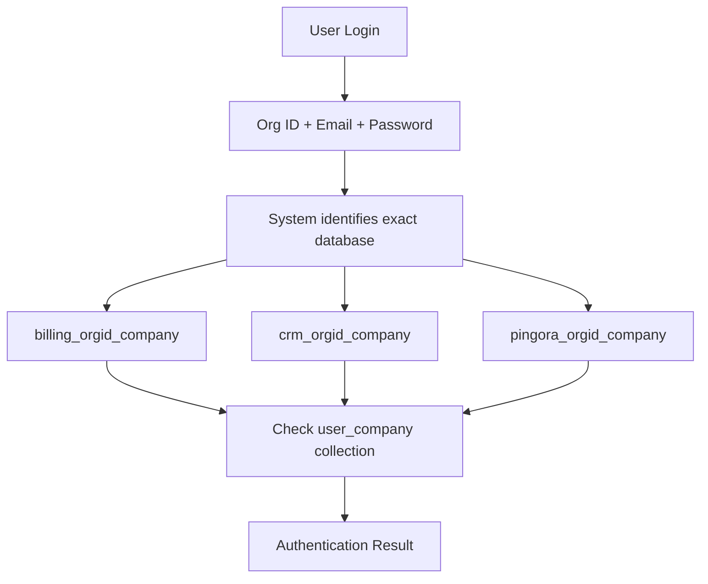

# 🗄️ Enhanced Database Naming Convention with Organization ID

## 📋 Overview

The multi-database system has been enhanced to include Organization ID in database names for more precise database identification during authentication and operations.

## 🔄 **Change Summary**

### **Previous Naming Convention**
```
billing_companyname
crm_companyname  
pingora_companyname
```

### **NEW Enhanced Naming Convention**
```
billing_orgid_companyname
crm_orgid_companyname
pingora_orgid_companyname
```

## 🎯 **Benefits of New Convention**

### ✅ **Precise Database Lookup**
- **Direct Identification**: User logs in with Org ID → System directly knows which database to check
- **No Ambiguity**: Even if company names are similar, Org ID ensures uniqueness
- **Faster Authentication**: Direct database targeting instead of searching

### ✅ **Better Organization**
- **Unique Identification**: Each database has a unique identifier (Org ID)
- **Scalable Structure**: Supports unlimited organizations without naming conflicts
- **Clear Hierarchy**: Service → Org ID → Company Name structure

### ✅ **Enhanced Security**
- **Isolated Access**: Org ID ensures users only access their organization's data
- **Audit Trail**: Clear identification of which organization's database is being accessed
- **Permission Control**: More granular control based on Org ID

## 🏗️ **Technical Implementation**

### **1. Database Service Functions**

#### **Enhanced getServiceDb Function**
```typescript
// New function with org ID support
export async function getServiceDb(
  serviceName: 'billing' | 'crm' | 'pingora', 
  orgName: string, 
  orgId?: string
): Promise<Db | null>

// NEW naming convention: servicename_orgid_companyname
const dbName = orgId 
  ? `${serviceName}_${orgId}_${sanitizedCompanyName}`
  : `${serviceName}_${sanitizedCompanyName}` // Backward compatibility
```

#### **New Helper Functions**
```typescript
// Preferred method for new implementations
export async function getServiceDbByOrgId(
  serviceName: 'billing' | 'crm' | 'pingora', 
  orgId: string, 
  orgName: string
): Promise<Db | null>

// Backward compatibility
export async function getServiceDbByOrgName(
  serviceName: 'billing' | 'crm' | 'pingora', 
  orgName: string
): Promise<Db | null>
```

### **2. Organization Database Creation**

#### **Enhanced Creation Process**
```typescript
// Uses new naming convention during creation
const databaseName = `${serviceName}_${orgData.id}_${sanitizedCompanyName}`

// Example: billing_ORG_123_techcorp_solutions
```

#### **Updated Multi-Database Service**
```typescript
static async createOrganizationDatabases(orgData: {
  id: string           // Organization ID (required)
  name: string         // Organization name
  adminEmail: string   // Admin email
  adminPassword: string // Admin password
})
```

### **3. Authentication Enhancement**

#### **Direct Database Lookup**
```typescript
// User provides: Org ID + Email + Password
// System directly targets: servicename_orgid_companyname

const db = await getServiceDbByOrgId(serviceName, organizationId, organizationName)
console.log(`🔍 Checking database: ${serviceName}_${organizationId}_${sanitizedCompanyName}`)
```

#### **Enhanced Authentication Flow**


## 🔧 **Updated APIs**

### **1. Analytics API** (`/api/admin/analytics`)
```typescript
// Now uses org ID for precise database targeting
const serviceDb = await getServiceDbByOrgId(serviceName, org.id, org.name)
const databaseName = `${serviceName}_${org.id}_${sanitizedCompanyName}`
```

### **2. User Management API** (`/api/admin/manage-service-users`)
```typescript
// Enhanced user management with org ID lookup
const db = await getServiceDbByOrgId(serviceName, organizationId, organizationName)
console.log(`📝 Managing users in: ${serviceName}_${organizationId}_${sanitizedCompanyName}`)
```

### **3. Multi-Database Test API** (`/api/admin/multi-database-test`)
```typescript
// Authentication testing uses org ID
const authResult = await MultiDatabaseService.authenticateUserAcrossServices(
  organizationId,  // Direct org ID targeting
  email,
  password
)
```

## 📊 **Database Structure Examples**

### **Example Organization: "TechCorp Solutions"**
- **Organization ID**: `ORG_1A2B3C4D_5E6F`
- **Organization Name**: `TechCorp Solutions`

#### **Created Databases:**
```
billing_ORG_1A2B3C4D_5E6F_techcorp_solutions
├── user_techcorp_solutions (Admin credentials)
├── invoices
├── payments
├── subscriptions
└── billing_config

crm_ORG_1A2B3C4D_5E6F_techcorp_solutions  
├── user_techcorp_solutions (Admin credentials)
├── contacts
├── leads
├── deals
└── crm_config

pingora_ORG_1A2B3C4D_5E6F_techcorp_solutions
├── user_techcorp_solutions (Admin credentials)
├── teams
├── projects
├── tasks
└── pingora_config
```

## 🔄 **Migration Strategy**

### **Backward Compatibility**
- **Old databases**: `billing_companyname` still work
- **New databases**: `billing_orgid_companyname` preferred
- **Gradual migration**: System tries new naming first, falls back to old

### **Migration Process**
```typescript
// 1. Try new naming convention
let db = await getServiceDbByOrgId(serviceName, orgId, orgName)

// 2. If not found, try old naming (backward compatibility)
if (!db) {
  db = await getServiceDbByOrgName(serviceName, orgName)
}

// 3. Log which method was used
console.log(db ? `✅ Connected via ${orgId ? 'new' : 'old'} naming` : '❌ Connection failed')
```

## 🎯 **Usage Examples**

### **1. Organization Creation**
```javascript
// Creates databases with new naming convention
POST /api/organizations
{
  "name": "TechCorp Solutions",
  "adminEmail": "admin@techcorp.com",
  "adminPassword": "secure123"
  // ... other fields
}

// Results in:
// billing_ORG_123_techcorp_solutions
// crm_ORG_123_techcorp_solutions  
// pingora_ORG_123_techcorp_solutions
```

### **2. User Authentication**
```javascript
// User login with org ID targeting
POST /api/workspace/login
{
  "accountId": "ORG_123",  // Organization ID
  "email": "user@techcorp.com",
  "password": "userpass123"
}

// System directly checks:
// billing_ORG_123_techcorp_solutions/user_techcorp_solutions
// crm_ORG_123_techcorp_solutions/user_techcorp_solutions
// pingora_ORG_123_techcorp_solutions/user_techcorp_solutions
```

### **3. Analytics Data**
```javascript
// Analytics now shows enhanced database names
{
  "organizationName": "TechCorp Solutions",
  "services": {
    "billing": {
      "databaseName": "billing_ORG_123_techcorp_solutions",
      "collections": [...],
      "totalDocuments": 1500
    },
    "crm": {
      "databaseName": "crm_ORG_123_techcorp_solutions", 
      "collections": [...],
      "totalDocuments": 2500
    }
  }
}
```

## 🚀 **Performance Benefits**

### **Faster Database Lookup**
- **Direct Targeting**: No need to search through multiple databases
- **Reduced Latency**: Immediate database identification
- **Efficient Connections**: Precise connection pooling

### **Scalable Architecture**  
- **Unlimited Organizations**: No naming conflicts
- **Clear Structure**: Easy to understand and maintain
- **Future-Proof**: Supports growth and expansion

## 🔍 **Monitoring and Debugging**

### **Enhanced Logging**
```javascript
// New logs show exact database being accessed
console.log(`🔍 Checking database: billing_ORG_123_techcorp_solutions`)
console.log(`📊 Analyzing database: crm_ORG_456_another_company`) 
console.log(`📝 Managing users in: pingora_ORG_789_startup_inc`)
```

### **Clear Audit Trail**
- **Database Access**: Each log shows exact database name
- **Organization Tracking**: Org ID visible in all operations  
- **Service Identification**: Clear service + org + company structure

## 🎉 **Key Improvements Achieved**

### ✅ **Precise Database Targeting**
- User login → Direct database identification
- No ambiguity in database selection
- Faster authentication process

### ✅ **Enhanced Organization Management**
- Unique database identification
- Clear organizational hierarchy
- Scalable naming convention

### ✅ **Improved System Performance**
- Direct database connections
- Reduced lookup time
- Efficient resource utilization

### ✅ **Better Maintainability**
- Clear database structure
- Easy debugging and monitoring
- Future-proof architecture

---

**🚀 The enhanced database naming convention with Organization ID provides precise, scalable, and efficient database management for the multi-tenant system!**

**📍 Key Changes:**
- **Database Names**: Now include Organization ID
- **Authentication**: Direct database targeting
- **Analytics**: Enhanced database identification
- **APIs**: All updated to use new convention
- **Backward Compatibility**: Old naming still supported

**🔗 Related Documentation:**
- [Multi-Database System](./MULTI_DATABASE_SYSTEM_DOCUMENTATION.md)
- [Organization Analytics](./ORGANIZATION_ANALYTICS_SYSTEM.md) 
- [Admin Authentication](./ADMIN_CREDENTIALS.md)
